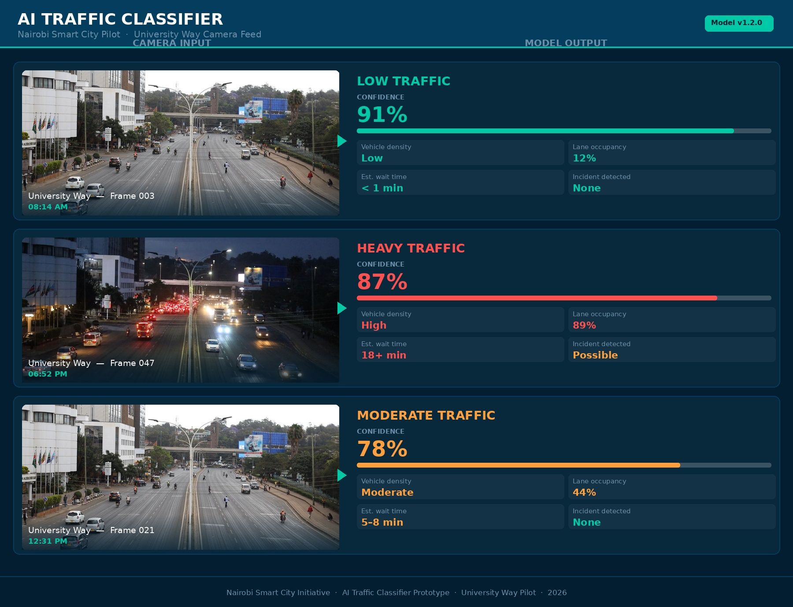

# Nairobi Smart Traffic AI (Prototype)



**Prototype Pilot: University Way, Nairobi**

AI-powered traffic intelligence system designed to analyze city traffic camera images and detect congestion levels and incidents in real time.

**Use case:** congestion monitoring, incident awareness, and city traffic analytics  
**Status:** prototype / proof-of-work (non-production)

---

## Live Demo

https://traffic.demicafrica.com

---

## Request a Pilot

Email: info@demicafrica.com  
Location: Nairobi, Kenya  
Pilot Area: University Way corridor

Interested in deploying this system or exploring a pilot program?  
Contact us to discuss collaboration opportunities.

---

## What this repo is (and isn’t)

### Included (public proof-of-work)

- Prototype CNN-based congestion classifier (image → congestion level)
- Demo workflow (notebook) using sample images
- Pilot brief (1-page PDF) for stakeholders
- Results & benchmark artifacts (screenshots/tables)
- High-level architecture overview

### Not included (kept private)

- Camera ingest (RTSP / streaming infrastructure)
- Production API services
- Deployment configuration
- Full training pipeline + operational configs
- Any API keys, secrets, or environment configuration

---

## About the Project

Nairobi Smart Traffic AI converts traffic camera imagery into **actionable mobility intelligence**.

The system analyzes camera frames and identifies:

- congestion levels
- potential traffic incidents
- traffic density patterns
- estimated wait times

This data can support:

- traffic management centers
- emergency response coordination
- urban mobility planning
- smart city infrastructure development

---

## Key Features

- AI-based congestion classification
- Traffic monitoring from existing camera feeds
- Incident detection signals
- Traffic analytics for city planning

---

## High-level Architecture (Prototype)

```mermaid
flowchart LR
  A["Traffic camera / image source"] --> B["Frame sampling"]
  B --> C["CNN inference"]
  C --> D["Congestion level: Low / Medium / High"]
  D --> E["Alerts & analytics dashboard (future)"]

---


